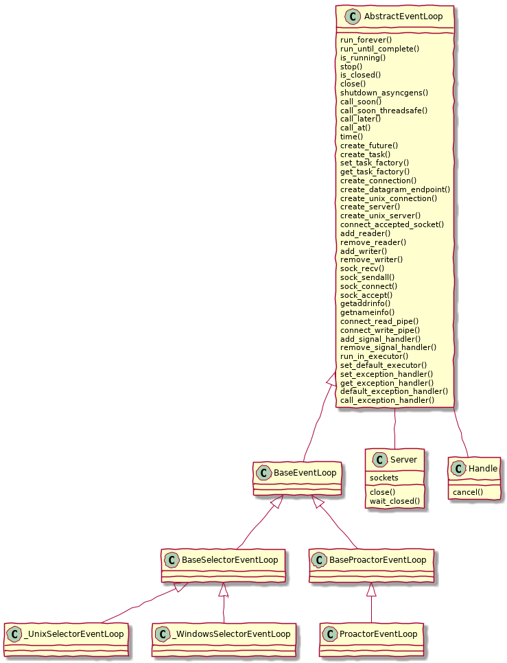
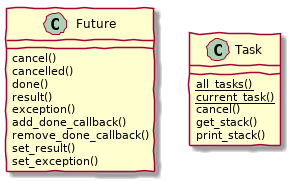
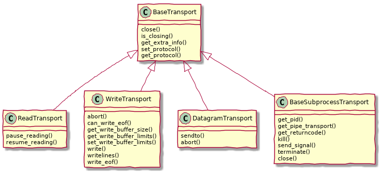
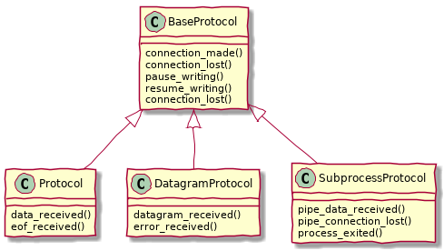
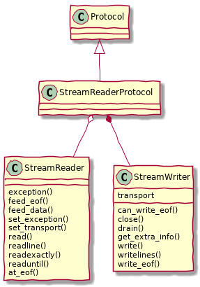
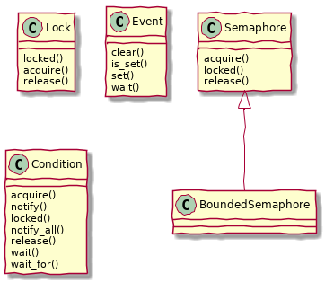
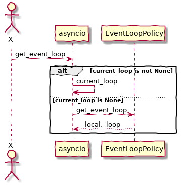
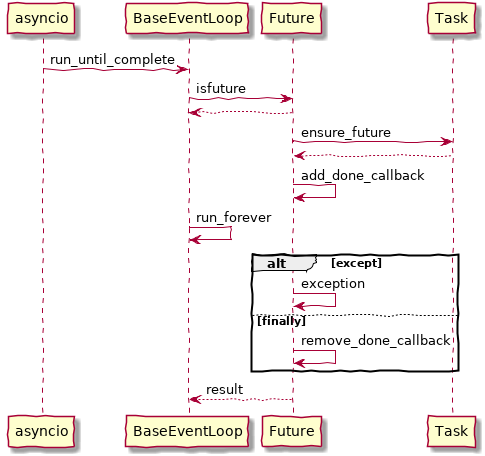
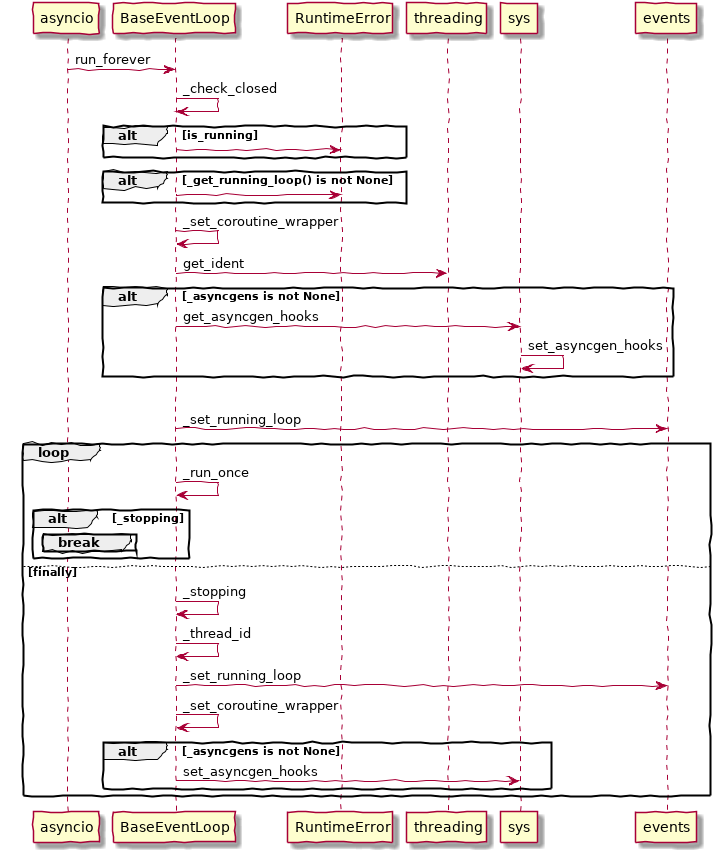
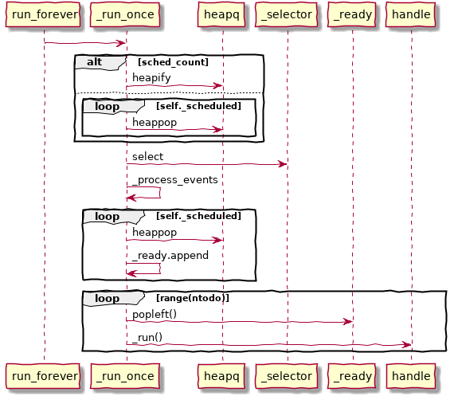

<section data-markdown data-separator="^\n---\n$" data-separator-vertical="^\n----\n$">
<script type="text/template">

# Python asyncio

----

## Part A

----

### 概念介绍

----

<!-- .slide: style="text-align: left;"> -->
**异步 IO**：就是发起一个 IO 操作，却不用等它结束，可以继续做其他事情。当它结束时，会得到通知。

----

<!-- .slide: style="text-align: left;"> -->
**asyncio**，并发（concurrency）的一种方式。对 Python 来说，并发还可以通过线程（threading）和多进程（multiprocessing）来实现。

----

<!-- .slide: style="text-align: left;"> -->
**asyncio**，并不能带来真正的并行（parallelism），因为 GIL（全局解释器锁）的存在，Python 的多线程也不能带来真正的并行。

----

<!-- .slide: style="text-align: left;"> -->
**协程**：可交给 asyncio 执行的任务，称为协程（coroutine）。一个协程可以放弃执行，把机会让给其它协程（即 yield from 或 await）

----

### 定义协程

----

````python
async def do_some_work(x):
    print("Waiting " + str(x))
    await asyncio.sleep(x)
````

----

````python
import asyncio

@asyncio.coroutine
def decorated(x):
    yield from x
````
````python
async def native(x):
    await x
````

[PEP 492](https://www.python.org/dev/peps/pep-0492/#differences-from-generators)

----

````python
asyncio.iscoroutinefunction(decorated)
asyncio.iscoroutinefunction(native)
````
````python
inspect.isgeneratorfunction(decorated)
inspect.isgeneratorfunction(native)
````

----

* result = await future or result = yield from future
* result = await coroutine or result = yield from coroutine
* return expression
* raise exception

----

### 运行协程

----

````python
loop = asyncio.get_event_loop() # blocking
loop.run_until_complete(do_some_work(4))
````

----

### 协程回调

----

````python
def done_callback(futu):
    print('Done')

futu = asyncio.ensure_future(do_some_work(4))
futu.add_done_callback(done_callback)

loop.run_until_complete(futu)
````

----

### 多个协程

----

#### asyncio.gather

````python
coros = [do_some_work(4), do_some_work(8)]
loop.run_until_complete(asyncio.gather(*coros))
````

````python
futures = [asyncio.ensure_future(do_some_work(4)),
             asyncio.ensure_future(do_some_work(8))]

loop.run_until_complete(asyncio.gather(*futures))
````

----

### API 简介

----

#### Event loops

* [get_event_loop()](https://docs.python.org/3.6/library/asyncio-eventloops.html#asyncio.get_event_loop)
* [set_event_loop(loop)](https://docs.python.org/3.6/library/asyncio-eventloops.html#asyncio.set_event_loop)
* [new_event_loop()](https://docs.python.org/3.6/library/asyncio-eventloops.html#asyncio.new_event_loop)

----



----

* [get_event_loop_policy()](https://docs.python.org/3.6/library/asyncio-eventloops.html#asyncio.get_event_loop_policy)
* [set_event_loop_policy(policy)](https://docs.python.org/3.6/library/asyncio-eventloops.html#asyncio.set_event_loop_policy)

----


----

#### Tasks and coroutines

* [@asyncio.coroutine](https://docs.python.org/3.6/library/asyncio-task.html#asyncio.coroutine)

----

* [as_completed(fs, *, loop=None, timeout=None)](https://docs.python.org/3.6/library/asyncio-task.html#asyncio.as_completed)
* [ensure_future(coro_or_future, *, loop=None)](https://docs.python.org/3.6/library/asyncio-task.html#asyncio.ensure_future)
* [wrap_future(future, *, loop=None)](https://docs.python.org/3.6/library/asyncio-task.html#asyncio.wrap_future)
* [gather(*coros_or_futures, loop=None, return_exceptions=False)](https://docs.python.org/3.6/library/asyncio-task.html#asyncio.gather)
* [wait(futures, *, loop=None, timeout=None, return_when=ALL_COMPLETED)](https://docs.python.org/3.6/library/asyncio-task.html#asyncio.wait)
* [wait_for(fut, timeout, *, loop=None)](https://docs.python.org/3.6/library/asyncio-task.html#asyncio.wait_for)

----

* [iscoroutine(obj)](https://docs.python.org/3.6/library/asyncio-task.html#asyncio.iscoroutine)
* [iscoroutinefunction(func)](https://docs.python.org/3.6/library/asyncio-task.html#asyncio.iscoroutinefunction)
* [run_coroutine_threadsafe(coro, loop)](https://docs.python.org/3.6/library/asyncio-task.html#asyncio.run_coroutine_threadsafe)
* [sleep(delay, result=None, *, loop=None)](https://docs.python.org/3.6/library/asyncio-task.html#asyncio.sleep)
* [shield(arg, *, loop=None)](https://docs.python.org/3.6/library/asyncio-task.html#asyncio.shield)

----



----

#### Transports

----



----

#### Protocols

----



----

#### Streams

* [open_connection(host=None, port=None, *, loop=None, limit=None, **kwds)](https://docs.python.org/3.6/library/asyncio-stream.html#asyncio.open_connection)
* [start_server(client_connected_cb, host=None, port=None, *, loop=None, limit=None, **kwds)](https://docs.python.org/3.6/library/asyncio-stream.html#asyncio.start_server)
* [open_unix_connection(path=None, *, loop=None, limit=None, **kwds)](https://docs.python.org/3.6/library/asyncio-stream.html#asyncio.open_unix_connection)
* [start_unix_server(client_connected_cb, path=None, *, loop=None, limit=None, **kwds)](https://docs.python.org/3.6/library/asyncio-stream.html#asyncio.start_unix_server)

----



----

#### Subprocess

* [create_subprocess_exec(*args, stdin=None, stdout=None, stderr=None, loop=None, limit=None, **kwds)](https://docs.python.org/3.6/library/asyncio-subprocess.html#asyncio.create_subprocess_exec)
* [create_subprocess_shell(cmd, stdin=None, stdout=None, stderr=None, loop=None, limit=None, **kwds)](https://docs.python.org/3.6/library/asyncio-subprocess.html#asyncio.create_subprocess_shell)

----

#### Synchronization

----



----

#### Queues

----


----

### 示例

----

#### Hello World
````python
import asyncio

async def hello_world():
    print("Hello World!")

loop = asyncio.get_event_loop()
# Blocking call which returns when the hello_world() coroutine is done
loop.run_until_complete(hello_world())
loop.close()
````

----

#### 打印时间
````python
import asyncio
import datetime

async def display_date(loop):
    end_time = loop.time() + 5.0
    while True:
        print(datetime.datetime.now())
        if (loop.time() + 1.0) >= end_time:
            break
        await asyncio.sleep(1)

loop = asyncio.get_event_loop()
# Blocking call which returns when the display_date() coroutine is done
loop.run_until_complete(display_date(loop))
loop.close()
````

----

#### 链式协程
````python
import asyncio

async def compute(x, y):
    print("Compute %s + %s ..." % (x, y))
    await asyncio.sleep(1.0)
    return x + y

async def print_sum(x, y):
    result = await compute(x, y)
    print("%s + %s = %s" % (x, y, result))

loop = asyncio.get_event_loop()
loop.run_until_complete(print_sum(1, 2))
loop.close()
````

----


----

#### Future
````python
import asyncio

async def slow_operation(future):
    await asyncio.sleep(1)
    future.set_result('Future is done!')

loop = asyncio.get_event_loop()
future = asyncio.Future()
asyncio.ensure_future(slow_operation(future))
loop.run_until_complete(future)
print(future.result())
loop.close()
````

----

#### 服务运行
````python
import asyncio

async def slow_operation(future):
    await asyncio.sleep(1)
    future.set_result('Future is done!')

def got_result(future):
    print(future.result())
    loop.stop()

loop = asyncio.get_event_loop()
future = asyncio.Future()
asyncio.ensure_future(slow_operation(future))
future.add_done_callback(got_result)
try:
    loop.run_forever()
finally:
    loop.close()
````

----

#### 并行任务
````python
import asyncio

async def factorial(name, number):
    f = 1
    for i in range(2, number+1):
        print("Task %s: Compute factorial(%s)..." % (name, i))
        await asyncio.sleep(1)
        f *= i
    print("Task %s: factorial(%s) = %s" % (name, number, f))

loop = asyncio.get_event_loop()
loop.run_until_complete(asyncio.gather(
    factorial("A", 2),
    factorial("B", 3),
    factorial("C", 4),
))
loop.close()
````

---

## Part B

----



----



----



----



---

## Part C

----

#### Thread

----

<!-- .slide: style="text-align: left;"> -->
**一系列按照线性顺序可以执行的指令**  
**一个逻辑上可以执行的路径**  
CPUs 中的每一个 Core 在同一时刻只能真正并发执行一个逻辑 Thread  
如果 Threads 个数大于 CPU 的 Core 个数的话，有一部分的 Threads 就必须要暂停来让其他 Threads 工作，直到这些 Threads 到达一定的时机时才会被恢复继续执行

----

<!-- .slide: style="text-align: left;"> -->
而暂停和恢复一个线程，至少需要记录两件事情  
* 当前执行的指令位置。前线程被暂停时，线程正在执行的代码行  
* 还需要一个栈空间。 这个栈空间保存了当前线程的状态。（对于 Java 来说，一个进程里面所有的 Threads 是共享一个堆内存的）  
有了上面两样东西后，CPU 在调度 Thread 的时候，就有了足够的信息，可以暂停一个 Thread，调度其他 Thread 运行，然后再将暂停的 Thread 恢复，从而继续执行。  
这些操作对于 Thread 来说通常是完全透明的。从 Thread 的角度来看，它一直都在连续的运行着

----

<!-- .slide: style="text-align: left;"> -->
操作系统的 Threads 的最大能力一般在万级别
主要消耗是在上下文切换的延迟
上下文的切换大概需要消耗 1-100µ 秒。在现实中每次平均切换需要消耗10µ秒

----

Python

----

<!-- .slide: style="text-align: left;"> -->
[Tornado](http://www.tornadoweb.org)  
Tornado is a Python web framework and asynchronous networking library, originally developed at FriendFeed. By using non-blocking network I/O, Tornado can scale to tens of thousands of open connections, making it ideal for long polling, WebSockets, and other applications that require a long-lived connection to each user.  

----

<!-- .slide: style="text-align: left;"> -->
[gevent](http://www.gevent.org/)  
gevent is a coroutine-based Python networking library that uses greenlet to provide a high-level synchronous API on top of the libev or libuv event loop.

----

<!-- .slide: style="text-align: left;"> -->
[uvloop](https://github.com/MagicStack/uvloop)  
uvloop is a fast, drop-in replacement of the built-in asyncio event loop. uvloop is implemented in Cython and uses libuv under the hood.  
[Server Performance Benchmark Report](https://magic.io/blog/uvloop-blazing-fast-python-networking/tcp-bench.html)

----

<!-- .slide: style="text-align: left;"> -->
[sanic](https://github.com/channelcat/sanic)
Async Python 3.5+ web server that's written to go fast

----

Node.JS

----

[yield](https://developer.mozilla.org/zh-CN/docs/Web/JavaScript/Reference/Operators/yield)
````javascript
function* countAppleSales () {
  var saleList = [3, 7, 5];
  for (var i = 0; i < saleList.length; i++) {
    yield saleList[i];
  }
}
````
````javascript
var appleStore = countAppleSales(); // Generator { }
console.log(appleStore.next()); // { value: 3, done: false }
console.log(appleStore.next()); // { value: 7, done: false }
console.log(appleStore.next()); // { value: 5, done: false }
console.log(appleStore.next()); // { value: undefined, done: true }
````

----

[Promise](https://developer.mozilla.org/zh-CN/docs/Web/JavaScript/Reference/Global_Objects/Promise)
````js
let person = {name: "didi"};
mongoDb
    .open()
    .then(function(database){
      return database.collection("users");
    })
    .then(function(collection){
      return collection.insert(person);
    })
    .then(function(result){
      console.log(result);
    })
    .catch(function(e){
      throw new Error(e);
    })
````

----

[co](https://github.com/tj/co)
````js
let co = require("co");
co(function *(){
    let db, collection, result;
    let person = {name: "didi"};
    try{
        db = yield mongoDb.open();
        collection = yield db.collection("users");
        result = yield collection.insert(person);
    }catch(e){
        console.error(e.message);
    }
    console.log(result);
});
````

----

[async](https://developer.mozilla.org/en-US/docs/Web/JavaScript/Reference/Statements/async_function)
````js
async function insertData(person){
    let db, collection, result;
    try{
        db = await mongoDb.open();
        collection = await db.collection("users");
        result = await collection.insert(person);
    }catch(e){
        console.error(e.message);
    }
    console.log(result);
}
insertData({name: "didi"});
````

----

Golang

----

<!-- .slide: style="text-align: left;"> -->
**Go runtime 调度器**  
用户空间线程和内核空间线程之间的映射关系：**M:N**

----

----

Java

----

<!-- .slide: style="text-align: left;"> -->
[Akka](https://akka.io/)  
[Netty](https://netty.io/)  

----

|    | asyncio | Node.JS | Golang | Java |
| -- | ------- | ------- | ------ | ---- |
| Cores | 单核 | 单核 | 多核 | 多核 |
| Native Thread | N | N | N | Y |
| Green Thread | Y | Y | ? | N |
| Callback | Y | Y | function | CompletionHandler |
| yield | 2.2 | v4.x | N | X |
| async | 3.5 | v8.x | N | X |

----

</script>
</section>
